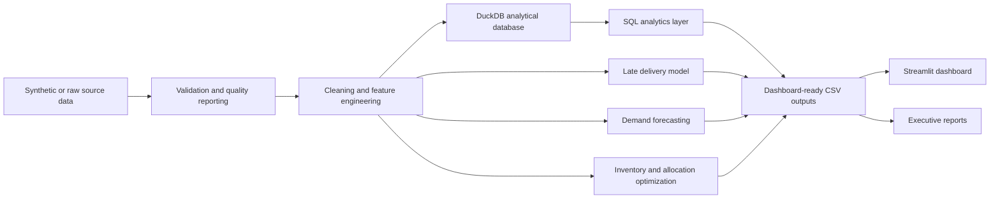
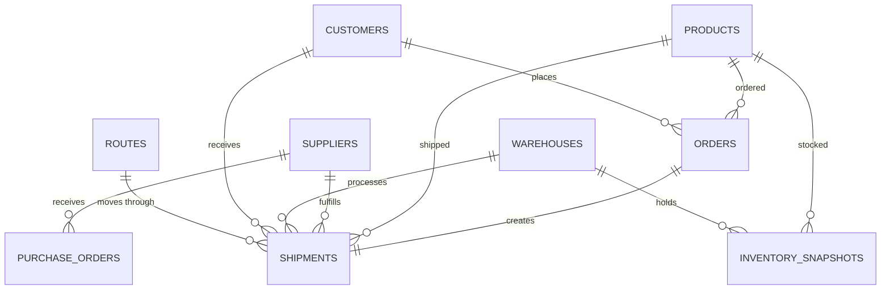

# Supply Chain Intelligence and Optimization Platform

An end-to-end portfolio project for supply chain analytics, predictive risk scoring, demand forecasting, inventory optimization, and logistics allocation.

## Business Problem

Logistics leaders need to understand which suppliers, carriers, routes, warehouses, products, and demand patterns are driving late deliveries, avoidable cost, stockouts, and poor service quality. This project turns raw operational data into validated analytical tables, dashboard views, predictive models, forecasts, optimization recommendations, and executive reporting.

## Business Value

- Identifies delay and cost drivers across suppliers, carriers, routes, warehouses, products, and customer regions.
- Predicts late shipment risk before delivery so operations teams can prioritize intervention.
- Forecasts future demand by product category and recommends inventory policies by product and warehouse.
- Estimates financial impact from delay cost, lost sales risk, excess inventory, and allocation inefficiency.

## Architecture



## Data Model



## Technology Stack

Python 3.12, Pandas, NumPy, DuckDB, SQL, scikit-learn, SciPy, Plotly, Streamlit, Pydantic, PyYAML, Joblib, Pytest, GitHub Actions, Docker.

## Repository Structure

```text
app/                  Streamlit dashboard
config/               YAML configuration
data/raw/             Generated or ingested raw CSV tables
data/processed/       Cleaned relational tables
data/output/          Dashboard-ready analytics, model, forecast, and optimization outputs
database/             DuckDB database
docs/                 Architecture, methodology, data dictionary, and talking points
models/               Persisted model artifacts and metric JSON
notebooks/            Reproducible EDA notebook placeholder
reports/              Generated HTML, Markdown, and JSON reports
scripts/              Pipeline and maintenance entry points
sql/                  Reusable SQL analytics layer
src/                  Modular Python package
tests/                Pytest suite
```

## Setup

```bash
python -m pip install -r requirements.txt
```

Or:

```bash
make setup
```

## Pipeline

```bash
python scripts/run_pipeline.py all
```

Supported stages:

```bash
python scripts/run_pipeline.py generate
python scripts/run_pipeline.py ingest
python scripts/run_pipeline.py validate
python scripts/run_pipeline.py transform
python scripts/run_pipeline.py train
python scripts/run_pipeline.py optimize
python scripts/run_pipeline.py report
python scripts/run_pipeline.py all
```

Common commands:

```bash
make data
make pipeline
make test
make dashboard
make report
make clean
```

## Dashboard

```bash
streamlit run app/app.py
```

Open the local Streamlit URL printed by the command. The dashboard includes Executive Overview, Shipment Performance, Supplier and Carrier Analysis, Route and Warehouse Analysis, Inventory and Demand Forecasting, Predictive Risk, Optimization Recommendations, and Data Quality and Pipeline Status.

## Testing

```bash
pytest
```

The test suite uses small deterministic datasets and does not require the full 50,000-shipment production run.

## Docker

```bash
docker build -t supply-chain-intelligence .
docker run --rm -p 8501:8501 -v "$PWD/data:/app/data" -v "$PWD/database:/app/database" -v "$PWD/models:/app/models" -v "$PWD/reports:/app/reports" supply-chain-intelligence
```

Docker Compose:

```bash
docker compose up --build
```

Run the pipeline inside a container:

```bash
docker compose run --rm dashboard python scripts/run_pipeline.py all
```

## Methodology Summary

The late delivery model uses a time-based split and excludes post-delivery fields such as actual delivery date, actual transit days, delay days, and shipment status. Forecasting is performed at weekly product-category grain with naive, seasonal naive, and machine learning forecasts. Inventory recommendations use service-level safety stock, reorder point, EOQ, and carrying-cost assumptions. Shipment allocation optimization uses linear programming to rebalance carrier-mode-priority allocations under capacity constraints.

## Generated Results

Latest verified run: July 22, 2026.

- Pipeline runtime: 7.83 seconds for the full `all` workflow.
- Raw shipment records generated: 50,060 including intentional duplicates and dirty records.
- Cleaned shipment records loaded to DuckDB: 49,992.
- Analytical database tables created: 21.
- Reporting period: 2024-01-01 to 2025-12-31.
- On-time delivery rate: 37.8%.
- Average delay: 1.15 days.
- Total logistics cost: $80.2M.
- Estimated delay cost: $1.33M.
- Estimated lost-sales exposure: $218.1K.
- Data quality results: 206,441 total records processed, 60 duplicate shipments detected, 8 records rejected, 13 records corrected, and 251 shipping-cost outliers flagged.

## Model Results

Late-delivery model selected by validation business score: random forest.

- Test rows: 6,317.
- Accuracy: 0.756.
- Precision: 0.829.
- Recall: 0.822.
- F1: 0.825.
- ROC AUC: 0.802.
- Precision-recall AUC: 0.902.

## Forecast Results

Weekly demand forecasting is evaluated at product-category grain.

- Naive WMAPE: 0.190.
- Seasonal naive WMAPE: 0.155.
- Histogram gradient boosting WMAPE: 0.158.
- Final forecast horizon: 12 weeks.

## Optimization Results

- Inventory recommendations generated: 960 product-warehouse combinations.
- Current carrier-mode allocation cost: $80.2M.
- Optimized carrier-mode allocation cost: $69.2M.
- Estimated allocation savings: $11.0M.
- Expected on-time rate improved from 37.8% to 37.9% under the aggregate allocation model.
- Maximum capacity utilization: 100.0%.

## Screenshots

Add dashboard screenshots after running the Streamlit app:

- Executive Overview
- Shipment Performance
- Predictive Risk
- Optimization Recommendations

## Limitations

- The default dataset is synthetic, although it intentionally includes realistic relationships and dirty records.
- Forecasts are built at product-category grain, not SKU-location-day grain.
- Allocation optimization is aggregate carrier-mode allocation, not full vehicle routing.
- Real deployment would need live data connectors, access controls, monitoring, and business-approved cost assumptions.

## Future Improvements

- Add warehouse labor schedules, carrier contract minimums, real weather feeds, and live ERP/WMS/TMS integrations.
- Add model monitoring, drift checks, and calibrated alert thresholds by shipment priority.
- Extend optimization to multi-echelon inventory and lane-level transportation constraints.

## Resume-Ready Project Description

- Built an end-to-end supply chain intelligence platform processing 49,992 cleaned shipments across 21 DuckDB analytical tables, with automated validation, cleaning, SQL transformations, reporting, and dashboard outputs.
- Trained a leakage-safe late-delivery prediction model using a time-based split, achieving 0.802 ROC AUC, 0.902 PR AUC, and 0.822 recall on the held-out test period.
- Implemented demand forecasting, inventory optimization for 960 product-warehouse combinations, and carrier-mode allocation optimization estimating $11.0M in logistics savings while preserving service reliability.

## Interview Discussion Points

See `docs/portfolio_talking_points.md`.

## License

MIT License. See `LICENSE`.
